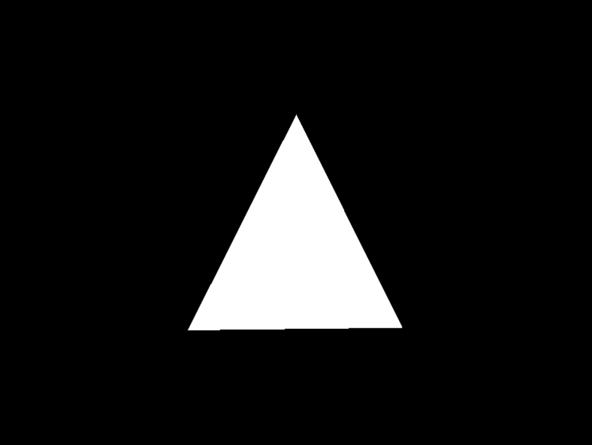

# Software renderer

## What is this ?

A basic software renderer written in [Rust](https://www.rust-lang.org/).



For the moment only renders a rotating triangle, but should get more intersting in the future.


## Things to come

Features that I plan on implementing:

- Rendering of arbitrary shapes
- Ability to assign colors to shapes 
- Texture mapping

### In macOS : 
```sh 
brew install sdl2
```


